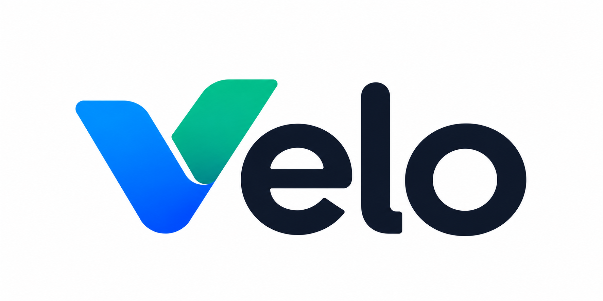
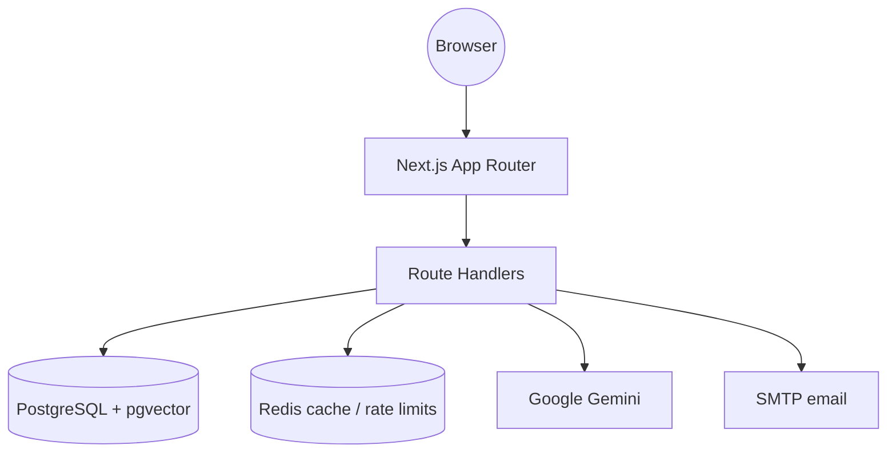

<div align="center">
  
  <h1>Velo</h1>
  <p><strong>AI-assisted project management for engineering teams</strong></p>

  <p>
    
    
    
    
    
    
  </p>
</div>

---

## Overview

Velo is a full-stack project management platform: Kanban boards, sprints, a team directory, a calendar, and analytics, with Google Gemini providing task summaries, assignee suggestions, and retrieval-augmented (RAG) insights grounded in your real project data.

## Features

- **Kanban boards**: drag-and-drop tasks with optimistic updates.
- **Role-based access control**: Admin, Manager, and Engineer roles, enforced on every API request.
  - Admins see every project and team, change roles, and remove people.
  - Managers create projects and choose which engineers work on them.
  - Engineers only see the projects they've been added to.
- **AI insights (RAG)**: tasks and comments are embedded with `gemini-embedding-2` into pgvector. The index syncs incrementally every minute and only re-embeds rows that changed. Insights cite the tasks they're based on.
- **Live analytics**: real data. The page polls every 60 seconds and only downloads the sections that changed.
- **Notifications**: in-app notifications for assignments, status changes, invites, and due dates.
- **Password reset**: single-use emailed links that expire after 30 minutes, sent over SMTP (Gmail supported).

## Architecture



## Quick start

### Prerequisites
- Node.js 20+
- PostgreSQL with the `vector` extension (Supabase works)
- Redis (Upstash works)
- A Google Gemini API key

### 1. Configure environment
```bash
cd app
cp .env.example .env
```
Fill in `DATABASE_URL`, `DIRECT_URL`, `JWT_SECRET`, the Redis variables, and `GEMINI_API_KEY`.

For password-reset emails with Gmail:
1. Turn on 2-Step Verification for the Gmail account.
2. Create an App Password at [myaccount.google.com/apppasswords](https://myaccount.google.com/apppasswords).
3. Set `SMTP_USER` and `EMAIL_FROM` to that Gmail address, and `SMTP_PASS` to the App Password.

If `SMTP_PASS` is empty in development, reset links are printed to the server log.

### 2. Run
```bash
npm install
npx prisma db push
npm run dev
```
The app runs at `http://localhost:3000`.

### 3. Checks
```bash
npx tsc --noEmit -p .
npx eslint src
npx jest src/__tests__
```

## Deployment (Vercel)

1. Import the repo and set the root directory to `app`.
2. Add every variable from `.env.example` under **Settings → Environment Variables**. Set `NEXT_PUBLIC_APP_URL` to your production URL, and mark `SMTP_PASS` as Sensitive.
3. Redeploy after changing environment variables.

The 60-second RAG sync runs inside a long-lived Node process. On serverless hosts it won't run reliably, so use a scheduled job there instead.

## Branding

The source logo is `logo/Velo.png`. The app uses assets generated from it:
- `app/public/velo-logo.png`: the wordmark with a transparent background.
- `app/public/velo-logo-light.png`: a version for dark backgrounds.
- `app/public/velo-mark.png`: the "V" mark on its own.
- `app/src/app/icon.png`, `apple-icon.png`, `favicon.ico`: browser and home-screen icons.
- `app/src/app/opengraph-image.png`: the link-preview image.

UI icons come from [lucide-react](https://lucide.dev).
