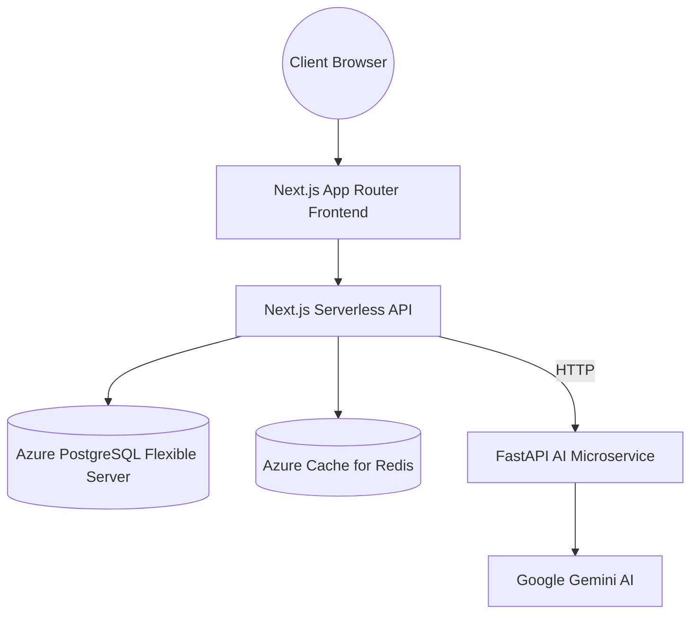

<div align="center">
  
  <h1>Velo Project Management</h1>
  <p><strong>A Next-Generation, AI-Powered Workspace for High-Velocity Teams</strong></p>

  <p>
    
    
    
    
    
    
  </p>
</div>

---

## ⚡ Overview

**Velo** is a premium, full-stack project management platform that combines traditional Kanban workflows with cutting-edge AI intelligence. Built from the ground up for modern engineering and design teams, it provides smart task assignment, deadline predictions, and AI-driven sprint planning directly inside your workspace.

Designed with a strict, professional light-mode aesthetic, Velo ensures that your work is always the central focus without visual clutter.

## ✨ Features

- 🧠 **AI-Powered Automation**: Native integration with Google Gemini via a decoupled Python microservice. AI parses tasks, suggests assignees, and summarizes projects automatically.
- 📋 **Kanban Boards**: Drag-and-drop task management powered by optimistic UI for zero-latency interactions.
- 🔐 **Role-Based Access Control**: Multi-tiered permissions (Admin, Manager, User) securely enforced at both the API and database level.
- 🎨 **Premium Aesthetics**: Glassmorphism, smooth micro-animations, and a highly polished UI.
- ☁️ **Cloud Native**: Designed to be deployed seamlessly on **Azure App Services**, **Azure PostgreSQL Flexible Server**, and **Azure Cache for Redis**.

## 🏗 Architecture

Velo utilizes a robust microservices architecture designed for extreme scalability:



## 🚀 Quick Start (Local Development)

### Prerequisites
- Node.js 20+
- Python 3.12+
- An Azure PostgreSQL Flexible Server instance (or local PostgreSQL)
- Upstash/Azure Redis instance
- Google Gemini API Key

### 1. Database & Environment Setup
Clone the repository and set up your `.env` variables in both `/app` and `/ai-service` using the provided `.env.example` templates.

Make sure your Azure PostgreSQL Connection string includes `?sslmode=require` and (if using pooler) `?pgbouncer=true`.

### 2. Start the Frontend
```bash
cd app
npm install
npx prisma db push
npm run dev
```

### 3. Start the AI Microservice
```bash
cd ai-service
python -m venv venv

# Windows
.\venv\Scripts\activate
# Mac/Linux
source venv/bin/activate

pip install -r requirements.txt
python main.py
```

The app will now be running on `http://localhost:3000` and the AI backend on `http://localhost:8000`.

## ☁️ Azure Deployment

Velo is engineered to be perfectly hosted on **Microsoft Azure**:
1. **Database**: Azure Database for PostgreSQL - Flexible Server (Version 16).
2. **Frontend**: Azure App Service (Node.js/Linux) or Azure Static Web Apps.
3. **AI Backend**: Azure Container Apps or Azure App Service (Python 3.12).
4. **Caching**: Azure Cache for Redis.

---
<div align="center">
  <p>Built with ❤️ by the Velo Team</p>
</div>
